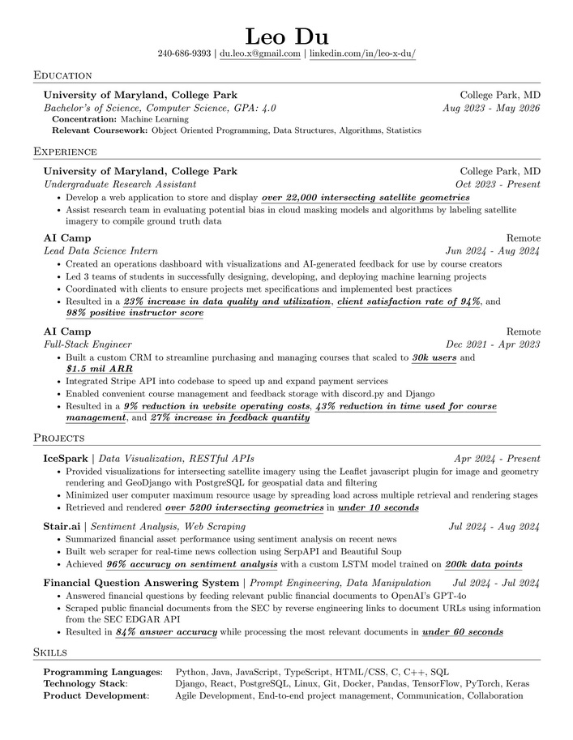

## Hi there 👋
### Who am I?
I have always loved robots. Drones, robot arms, robot dogs, they all captured my imagination. As I entered high school, I grew to love watching people teach robots to walk, solve puzzles, and play games using reinforcement learning, which inspired my decision to pursue computer science in college. Throughout my time as a computer science student, I have established three skills and values that influence everything I do: rapid learning, planning, and discipline.

The first skill that pushes me forward is rapid learning. In the modern age, with how quickly technology is advancing, it’s important to keep up with emerging technologies. To facilitate this, I have learned to learn rapidly and to understand and utilize new information quickly. This was best demonstrated during my time as a Lead Data Science Intern. When I was presented with a project outline that required me to use a new Large Language Model (LLM) framework that I had never worked with before, I immediately got to work understanding the benefits, drawbacks, and limitations of the frameworks. Within three days, I was able to create a specification for a product that effectively utilized the framework while also working around the limitations of the framework.

Another skill that I have always valued throughout my college career is thorough planning. When working on large projects, it can be easy to lose track of the important details, get stuck, or get in your own way due to past actions. Planning can solve all these problems, and has made my life significantly easier. It keeps me on track to hit deadlines and lets me identify potential issues before they occur. A great example of this is during a class project for a computer science class, where I was tasked with designing and implementing an interpreter for the OCaml programming language. This would be a substantial undertaking, and I had only two weeks to complete it. However, I made the project significantly easier and was able to complete the project with time to spare by planning, setting deadlines for myself, and outlining the entire project at the start.

The trait that I prize the most is discipline. While some think that discipline forces rigidity and limits creativity, I do not believe discipline and creativity must be mutually exclusive. Discipline helps me stick to plans and drives me to give my all, even in tasks that I may not be enthusiastic about. During the spring semester of 2024, I was incredibly busy with a constant barrage of projects and exams. It would have been extremely easy to skip lectures and slack on assignments to buy time for relaxation. However, I stayed disciplined and followed a strict schedule. This gave me enough time to complete assignments to the best of my ability, while also being able to attend all lectures and maintain a healthy sleep schedule. 

As the end of my undergraduate degree draws closer, I will bring the skills and values I previously discussed into my future endeavors as I explore the future of robotics and reinforcement learning. Through rapid learning, planning, and discipline, I aim to bring greater success in the workplace, whether that be in academia or industry.

---

### Resume

---
### Projects
#### Financial Document Summary System
Developed over the course of three weeks, this system combines the EDGAR database with novel LLM technology to answer questions about any publically listed company by analyzing publically available financial documents.

Click [here](https://github.com/leo-du-03/financial-document/) to see all the code!

#### Stair.ai
This project is an exploration into sentiment analysis. It uses LSTMs to perform sentiment analysis on news to determine overall public sentiment on financial topics.

Click [here](https://github.com/leo-du-03/stair/) to see all the code!

#### MicrOCaml Interpreter
An interpreter (lexer, parser, evaluator) for a trimmed-down variant of OCaml built using OCaml.

Click [here](https://github.com/leo-du-03/MicrOCaml/) to see all the code!
